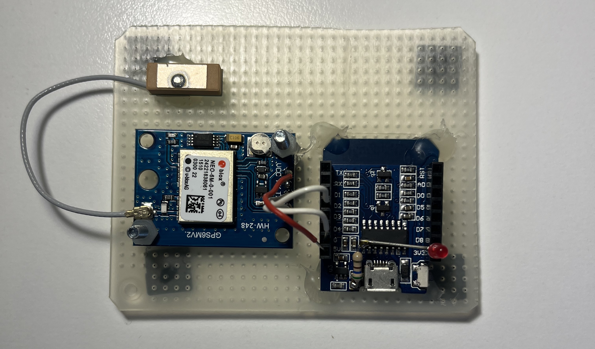
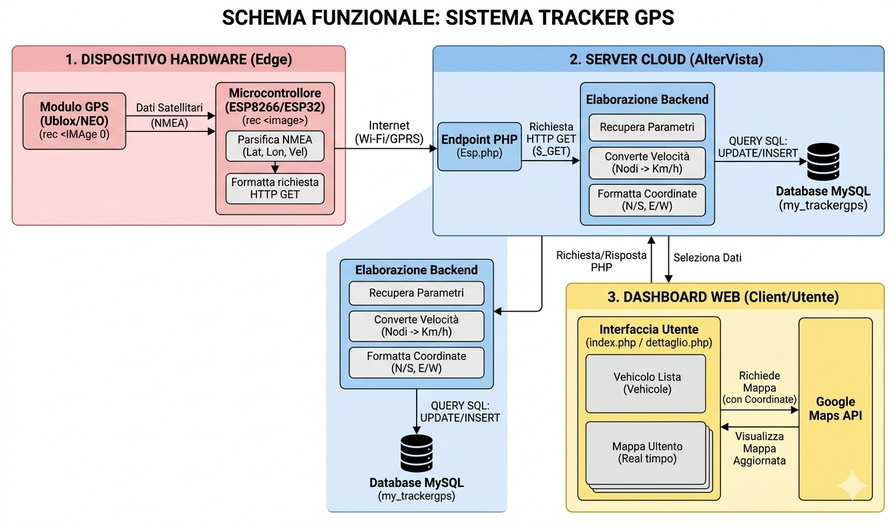

# Tracker GPS - Sistema di Monitoraggio IoT

Questo progetto è un sistema completo di tracciamento GPS in tempo reale, sviluppato come progetto per l'Esame di Stato. Il sistema integra un'architettura hardware (basata su microcontrollore ESP) con una piattaforma web per la visualizzazione dei dati.




## Schema di Funzionamento
Il sistema segue un flusso di dati end-to-end:
1. **Hardware (Edge):** Un modulo GPS raccoglie le coordinate e la velocità, inviandole a un microcontrollore ESP8266/ESP32.
2. **Trasmissione:** L'ESP invia i dati grezzi tramite una richiesta HTTP GET al server.
3. **Backend (Server):** Lo script `Esp.php` riceve i dati, converte la velocità da nodi a km/h, formatta le coordinate e le salva in un database MySQL.
4. **Frontend (Client):** Una dashboard web interroga il database e mostra la posizione del veicolo su una mappa interattiva utilizzando le Google Maps API.

## Funzionalità principali
- **Tracking Real-time:** Visualizzazione immediata della posizione sulla mappa.
- **Conversione Dati:** Calcolo automatico della velocità e formattazione geografica.
- **Gestione Veicoli:** Area riservata per monitorare diversi mezzi (Lorenzo, Andrea, ecc.).
- **Interfaccia Responsive:** Basata sul template "Future Imperfect" per una consultazione ottimale da ogni dispositivo.

## Stack Tecnologico
- **Hardware:** ESP-12F D1 Mini, Modulo GPS Ublox NEO.
- **Backend:** PHP 8.x.
- **Database:** MySQL (ospitato su AlterVista).
- **Frontend:** HTML5, CSS3, JavaScript (jQuery).
- **Mappe:** Google Maps JavaScript API.

## Struttura del Repository
- `/src`: Codice sorgente dell'applicazione web.
- `/db`: Dump del database (`database.sql`) per la configurazione iniziale.
- `/assets`: File statici (CSS, JS, Immagini).
- `README.md`: Documentazione del progetto.

## Configurazione rapida
1. Importa il file `database.sql` nel tuo server MySQL.
2. Configura le credenziali di accesso nel file di connessione PHP (localhost/root per test locale).
3. Inserisci la tua `API_KEY` di Google Maps nei file `index.php` e `dettaglio.php`.

Schema configurazione hardware:




Per sicurezza, i dati di accesso al database devono essere configurati correttamente. Attualmente il codice punta a localhost con utente root.
Si consiglia di creare un file di configurazione o aggiornare le stringhe di connessione in:

```
$conn = new mysqli('tuo_host', 'tuo_user', 'tua_password', 'my_trackergps');
```

### API Google Maps
Il progetto utilizza le API di Google Maps. Per visualizzare correttamente le mappe, assicurati che la chiave API inserita nei file index.php e dettaglio.php sia attiva o sostituiscila con la tua:

```
<script src="[https://maps.googleapis.com/maps/api/js?key=TUA_API_KEY](https://maps.googleapis.com/maps/api/js?key=TUA_API_KEY)"></script>
```


---
**Sviluppatori:** Andrea Bianucci & Lorenzo Marianini.
*Progetto didattico realizzato per la Maturità delle Scuole Superiori.*
